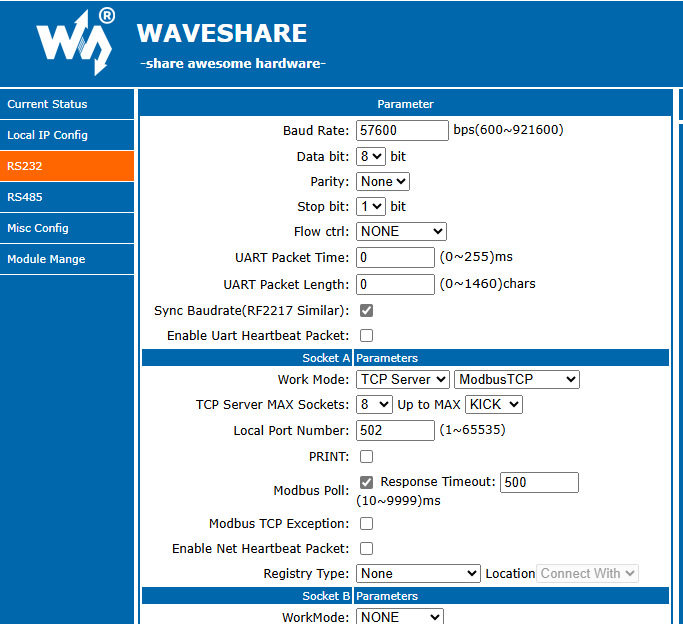

# Froeling Lambdatronic Modbus
Home Assistant integration for Fröling Lambdatronic heating systems via Modbus (currently supports Modbus TCP only - maybe ).

## 🚀 Features
With this integration, you can:
- Read real-time sensor data from your Fröling heating system.
- Monitor boiler performance and operational parameters.
- Configure heating system settings directly from Home Assistant.

---

## 💻 Requirements
To communicate with the heating system, you need a Modbus-to-TCP device.  
This integration has been tested with the **Waveshare RS232/RS485 to Ethernet Converter**, but other Serial-to-Ethernet adapters should work.

### 🔧 Enabling Modbus RTU on the Boiler
To enable Modbus RTU on your Fröling boiler:

1. Navigate to **Boiler Settings**.
2. Click the user icon and enter code `-7`.
3. Adjust the following settings:  
    - **Settings > General Settings > MODBUS Settings > Modbus Protokoll RTU** → `Set to 1`  
    - **Settings > General Settings > MODBUS Settings > Use Modbus Protokoll 2014** → `Yes`  
    - **Settings > General Settings > MODBUS Settings > Use COM2 as MODBUS Interface** → `Yes`  

---

## 🛠️ Hardware Setup
I used a [Waveshare RS232/RS485 to Ethernet Converter](https://www.waveshare.com/rs232-485-to-eth.htm) and connected **RS232 to COM2** on the boiler.

Other Serial-to-Ethernet converters should work as well.

---

## 📦 Installation
### Manual
- Download [latest release](https://github.com/GyroGearl00se/ha_froeling_lambdatronic_modbus/releases).
- Copy the custom_components/froeling_lambdatronic_modbus into your Home Assistant `custom_components` folder.
- Restart Home Assistant.
- Add the integration via the Home Assistant UI.

### HACS
- Open HACS and click on the 3 dots in the top right corner.
- Select "Custom repositories"
- Add the URL "https://github.com/GyroGearl00se/ha_froeling_lambdatronic_modbus" to the repository. Select type "Integration"
- Click the "ADD" button.
- Install the Integration via HACS UI.
---

## 🛠️ Setup
- Open Home Assistant Settings > Integrations
- "\+ Add Integration" and select "Froeling Lambdatronic Modbus"
- Fill out the configuration form
    - Enter a device name (Default: Froeling)
    - Hostname/IP of your Modbus TCP device
    - Port (Default: 502)
    - Update Interval (Default: 60s)
    - Select the components which are enabled on your unit
        - Currently available:  
        Kessel (Boiler)  
        Boiler 01 (DHW Boiler)  
        Heizkreis 01 (Heating Circuit)  
        Heizkreis 02 (Heating Circuit)  
        Austragung (Feed System)  
        Puffer 01 (Buffer)  
        Zirkulationspumpe (Circulations Pump)
        ... More to come. If you're missing a component - let me know.

- Click the "OK" button

## 🧡 Contributing
Contributions are welcome!  

1. **[Fork this repository](https://docs.github.com/en/get-started/quickstart/fork-a-repo).**  
2. Make changes within your fork.  
3. **[Create a pull request](https://docs.github.com/en/pull-requests/collaborating-with-pull-requests/proposing-changes-to-your-work-with-pull-requests/creating-a-pull-request).**  

I’ll do my best to review and merge contributions.
