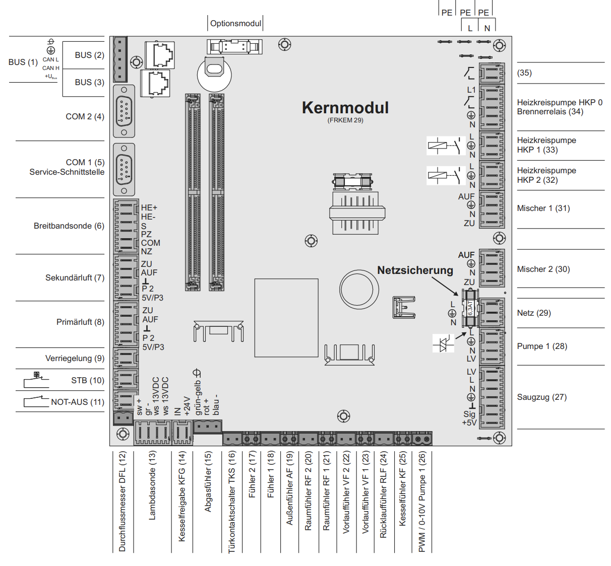
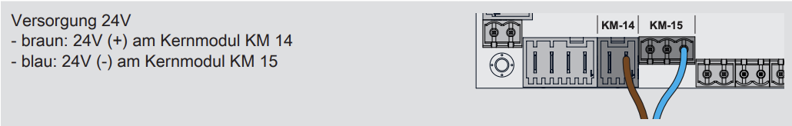
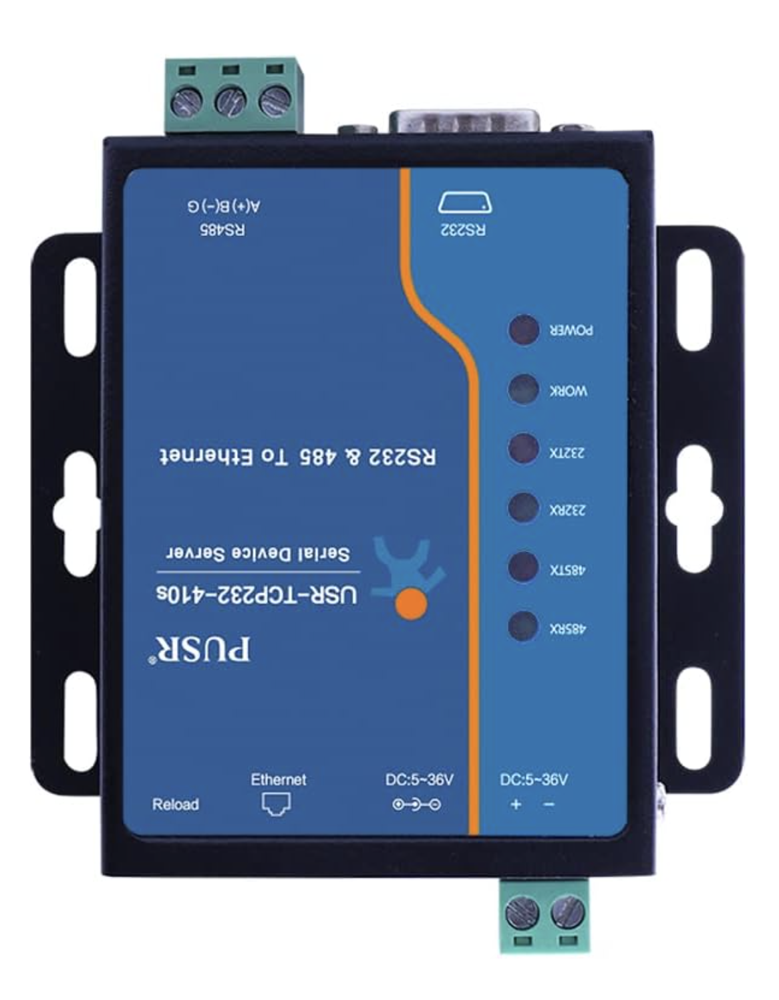

# ⚡ Power supply

⚠️ I recommend using the original power supply that came with your Serial-Ethernet converter. ⚠️

However, if you prefer an alternative solution, you can also power the converter directly from the Fröling board.

Before proceeding, make sure to check the input voltage requirements of your converter.
If 24 V DC falls within its supported range, you can supply power from the Fröling board.

(Photos below show the relevant terminals and wiring connections.)

